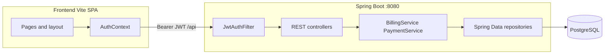
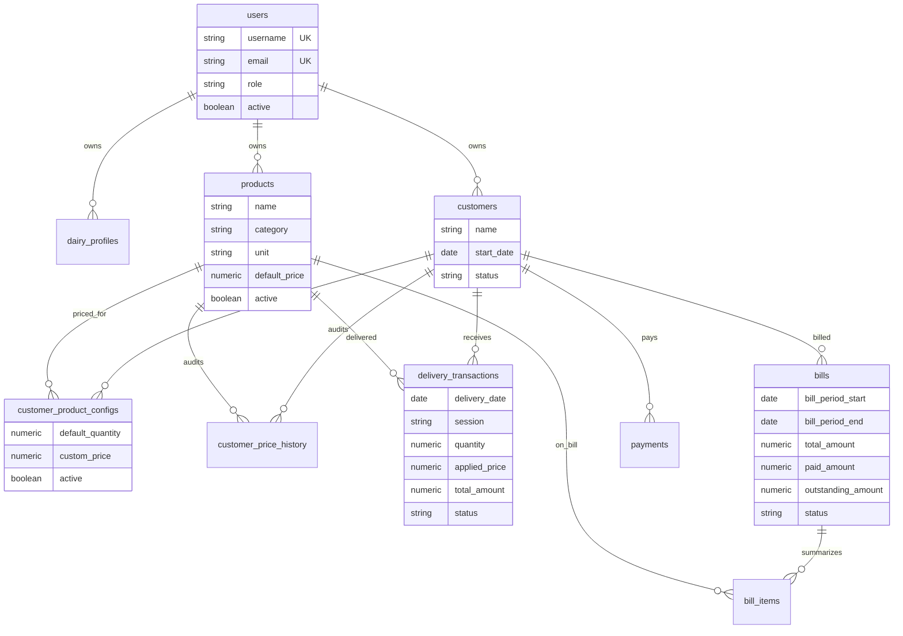
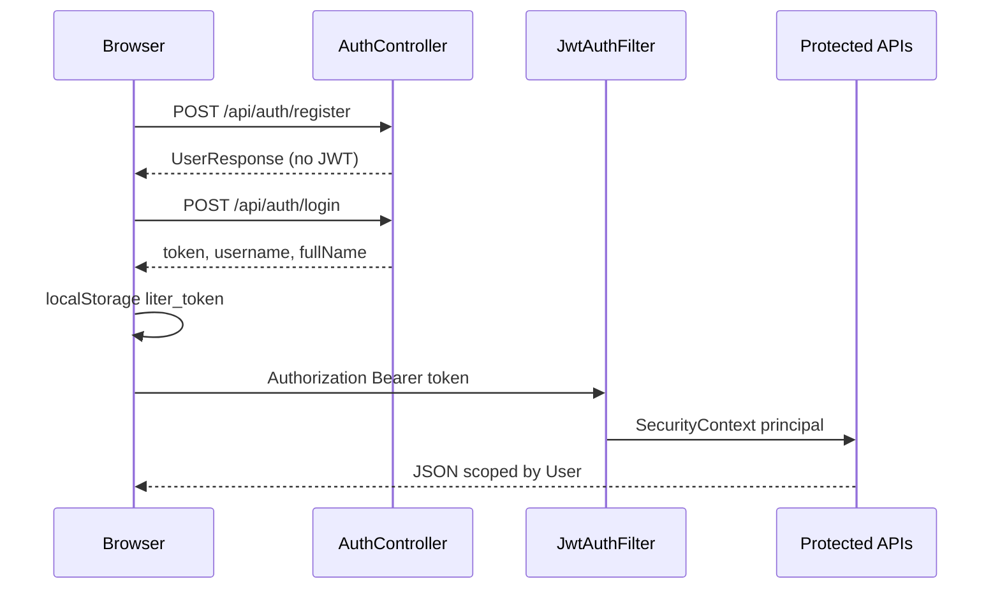
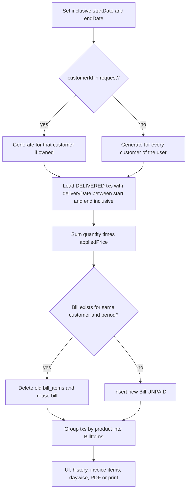

# LITER

**Dairy Business Management** for dairy owners who deliver milk and related products on a daily route.

🟢 **Live app:** [liter-nine.vercel.app](https://liter-nine.vercel.app/)

LITER is a full-stack web application used by the **dairy owner**, not by customers. Each registered account owns its own customers, products, deliveries, and bills. The app covers the daily operational loop: maintain a catalog, enroll customers with subscription quantities and custom prices, mark present/absent on a daily delivery sheet, generate period bills from **actual delivered transactions**, and review sales analytics.

There is no customer portal, no employee-role UI, and no production/inventory module in the current codebase.

## Badges
Top of README after the title:
```
     
```

---

## Table of contents

- [Problem](#problem)
- [Project overview](#project-overview)
- [Key features](#key-features)
- [Technology stack](#technology-stack)
- [Architecture](#architecture)
- [Repository structure](#repository-structure)
- [Data model](#data-model)
- [Authentication and authorization](#authentication-and-authorization)
- [API overview](#api-overview)
- [Business logic](#business-logic)
- [Billing workflow](#billing-workflow)
- [Environment variables](#environment-variables)
- [Prerequisites](#prerequisites)
- [Local setup](#local-setup)
- [Database and schema](#database-and-schema)
- [Testing](#testing)
- [Deployment](#deployment)
- [Responsive design](#responsive-design)
- [Security notes](#security-notes)
- [Future improvements](#future-improvements)
- [License](#license)

---

## Problem

Small dairy businesses typically track daily litres, absences, customer-specific rates, and monthly dues in notebooks or spreadsheets. That makes it easy to miss a skip day, bill the wrong quantity, or mix one owner's data with another.

LITER records each day's **delivery snapshot** (quantity, unit, applied price, status) per customer and product, then bills from those rows for an inclusive date range.

---

## Project overview

| Layer | Role |
| --- | --- |
| **Frontend** | React SPA (Vite). Public marketing/home, register, login; authenticated app for operations. |
| **Backend** | Spring Boot REST API under `/api`. JWT session. PostgreSQL via Spring Data JPA. |
| **Database** | PostgreSQL. Schema is created/updated with Hibernate `ddl-auto: update` plus a startup SQL migrator. |

Default local API: `http://localhost:8080`. Default Vite dev server: `http://localhost:5173`. Frontend calls the API through `VITE_API_URL` (see [Environment variables](#environment-variables)).

On first boot with an empty `users` table, the backend seeds one owner account (`LiterApplication`): username `admin`. Change this immediately in any shared environment.

---

## Key features

Implemented in the current source (frontend pages + matching controllers unless noted).

### Authentication

- Register (`username`, `password`, `email`, `fullName`, `businessName`) creates a `User` with role `ROLE_OWNER` and a `DairyProfile`.
- Login returns a JWT plus username and full name.
- Session is stored in `localStorage` (`liter_token`, `liter_username`, `liter_fullname`, `liter_session_timestamp`) and treated as expired after 30 days on the client. JWT expiry is configured separately (`liter.jwt.expiration-ms`).
- `ProtectedRoute` sends unauthenticated users to `/login`.
- `/api/auth/me` returns the current user.
- Login UI includes a **simulated** password-reset form (client timeout only). There is **no** password-reset API.

### Multi-owner data isolation

- Customers and products are linked to `User` (`user_id`).
- Customer list, product list, delivery sheet, bill generate/history/delete, analytics, and settings profile are resolved from the authenticated principal.
- Registering a second owner does not share the first owner's customers.

### Customer management (`/customers`)

- Create, update, list, and hard-delete customers owned by the current user.
- Case-insensitive unique name per owner.
- Fields persisted: name, mobile, address, start date, notes, status `ACTIVE` / `INACTIVE`.
- Creating a customer also creates a `CustomerProductConfig` (quantity/rate from the form, or a milk-like product fallback).
- Inline product configs: default quantity, custom price, active flag.

### Product catalog (`/products`)

- CRUD plus active/inactive toggle, scoped to the current user.
- Fields: name, category, unit, default price, active.

### Customer-specific pricing

- `CustomerProductConfig.customPrice` overrides `Product.defaultPrice` when set.
- Changing custom price writes `CustomerPriceHistory` (previous open row ended yesterday; new row starts today).
- Delivery rows store **`appliedPrice` and `totalAmount` at save time**, so later catalog/config changes do not rewrite historical deliveries.

### Daily delivery (`/delivery`)

- Single **daily** sheet for a chosen date (`session` query defaults to `DAILY`).
- Sheet is built from customers whose effective start date is on or before that date, plus any extra saved transactions for the date.
- Per row: default quantity vs actual quantity, status `UNMARKED` / `DELIVERED` / `SKIPPED`.
- Individual present/absent and bulk **Mark all present** / **Mark all absent**.
- Quantity adjustments with product-aware presets (milk litres, paneer kg, curd packs) and **extra product** lines.
- Notes on the adjustment modal.
- Monthly **attendance calendar** via `/api/deliveries/customer-history/{customerId}`.
- Bulk upsert via `POST /api/deliveries/bulk`. Deliveries before a customer's effective start date are rejected.

### Billing (`/billing`)

- Inclusive **start date** and **end date** filters; optional customer filter; search on the bill list.
- Generate for one customer or for all customers of the current user.
- Bills are computed from `DELIVERED` transactions in that inclusive range (not from subscription defaults).
- Invoice modal: dairy profile header, product summary (`/items`), chronological day-wise deliveries (`/daywise`).
- Preview, browser print, and A4 PDF download (`html2pdf.js` loaded from CDN in `index.html`; falls back to `window.print()`).
- Delete one bill or all bills for the current user.

### Payments (API + tests; no payments page)

- `POST /api/payments` records a payment and allocates it FIFO to unpaid/partial bills.
- `GET /api/payments` lists by `customerId` or all rows.
- The React app does **not** call these endpoints.

### Dashboard (`/dashboard`)

- Cards from `GET /api/reports/dashboard`: today's sales, milk volume (name/category contains `"milk"`), customers served today, sum of bill outstanding amounts.
- Quick links to delivery, customers, and billing.

### Reports (`/reports`)

- `GET /api/reports/analytics` with start/end, optional `productId` / `customerId`.
- UI presets: Today, This Week, This Month, Last Month, Custom Range, plus a historical month picker.
- Summary cards, product share, top customers, day trend, 6-month trend, tabbed tables (products / customers / day-wise).
- Additional unused-by-UI endpoints: `GET /api/reports/products`, `GET /api/reports/customers`.

### Settings (`/settings`)

- Load/save dairy profile: business name, owner name, mobile, address, UPI id.
- Saving owner name also updates `User.fullName`.
- Delete account (`DELETE /api/settings/account`) then client logout.

### Public site

- `/` marketing home. Authenticated visitors are redirected to `/dashboard`.
- `/register` and `/login`.

---

## Technology stack

Verified from `backend/pom.xml`, `frontend/package.json`, `application.yml`, and `index.html`.

| Area | Actual stack |
| --- | --- |
| Language (API) | Java 21 |
| Framework (API) | Spring Boot **3.3.2** (`spring-boot-starter-web`, Data JPA, Security, Validation) |
| Auth | Spring Security + JJWT **0.11.5** (HS256) |
| Persistence | Spring Data JPA, Hibernate `ddl-auto: update`, PostgreSQL driver |
| Build (API) | Maven, `spring-boot-maven-plugin` executable JAR |
| Language (UI) | TypeScript, React **19**, React DOM 19 |
| Routing | `react-router-dom` **7** |
| Build (UI) | Vite **8**, `@vitejs/plugin-react` |
| UI libraries | `lucide-react`, `date-fns` |
| PDF | `html2pdf.js` (CDN script, not an npm dependency) |
| Lint | `oxlint` (`npm run lint`) |
| Database (local compose) | `postgres:15-alpine` |
| Containers | `backend/Dockerfile` (Temurin 21 JRE); root `docker-compose.yml` is **Postgres only** |

Not present: Flyway/Liquibase, Redis, H2, Maven Wrapper (`mvnw`), GitHub Actions, `render.yaml`.

---

## Architecture



Request path: browser → `getApiUrl()` (`VITE_API_URL` or `http://localhost:8080/api`) → Spring Security → controller → JPA → PostgreSQL.

Timezone: `LiterApplication` sets the JVM default to `Asia/Kolkata`. Jackson is configured with `time-zone: UTC` in `application.yml`.

---

## Repository structure

```
Liter/
├── backend/
│   ├── Dockerfile                 # Multi-stage Maven package → JRE image, port 8080
│   ├── pom.xml
│   └── src/
│       ├── main/java/com/liter/
│       │   ├── LiterApplication.java
│       │   ├── config/            # DatabaseSchemaMigrator (SQL on ApplicationReady)
│       │   ├── controller/        # REST endpoints
│       │   ├── dto/
│       │   ├── model/             # JPA entities
│       │   ├── repository/
│       │   ├── security/          # JWT dev fallback secret, JWT filter, SecurityConfig
│       │   └── service/           # BillingService, PaymentService
│       ├── main/resources/application.yml
│       └── test/java/com/liter/service/BillingAndPaymentTests.java
├── frontend/
│   ├── index.html                 # viewport, theme-color, html2pdf CDN
│   ├── vercel.json                # SPA rewrite to index.html
│   ├── vite.config.ts
│   ├── package.json
│   ├── .env.example               # template — copy to .env
│   └── src/
│       ├── main.tsx / App.tsx / App.css / index.css
│       ├── config/api.ts
│       ├── context/AuthContext.tsx
│       ├── components/            # Header, Sidebar, BottomNav, MoreDrawer, ProtectedRoute
│       └── pages/                 # Home, Login, Register, Dashboard, Deliveries, Customers,
│                                  # Billing, Products, Reports, Settings
├── docker-compose.yml             # PostgreSQL service only
├── requirement.md                 # Product requirements (includes out-of-scope roadmap)
├── implementation.md              # Earlier architecture notes (some paths differ from the tree)
└── README.md
```

---

## Data model



| Entity | Table | Ownership / notes |
| --- | --- | --- |
| `User` | `users` | Unique username and email; default role `ROLE_OWNER`. |
| `DairyProfile` | `dairy_profiles` | Optional `user_id`; business identity and UPI. |
| `Customer` | `customers` | `user_id`; unique name per user (repository). Transient `productId` / `quantity` / `rate` on create. |
| `Product` | `products` | `user_id`. |
| `CustomerProductConfig` | `customer_product_configs` | Unique `(customer_id, product_id)`. |
| `CustomerPriceHistory` | `customer_price_history` | Open interval when `end_date` is null. |
| `DeliveryTransaction` | `delivery_transactions` | Unique `(customer_id, product_id, delivery_date, session)`. Status values used in code: `DELIVERED`, `SKIPPED`; sheet also uses `UNMARKED` before save. |
| `Bill` | `bills` | Status `UNPAID`, `PARTIALLY_PAID`, `PAID`. |
| `BillItem` | `bill_items` | Per-product totals and average price for the bill period. |
| `Payment` | `payments` | Methods stored as strings. |

---

## Authentication and authorization



`SecurityConfig`:

- CSRF disabled; CORS `allowedOriginPatterns: *`, credentials allowed.
- Permit: `OPTIONS /**`, `/api/auth/**`, `/auth/**`, `/error`.
- All other requests require authentication.
- JWT is read from `Authorization: Bearer …`. Inactive users cannot authenticate (`UserDetailsServiceImpl`).

Authorization in practice is **resource ownership** (compare `customer.user.id` / `product.user` to the principal), not a separate role matrix. New registrations always receive `ROLE_OWNER`.

---

## API overview

Base path: `/api`. All routes below exist on the controllers listed.

### Auth — `/api/auth`

| Method | Path | Auth | Purpose |
| --- | --- | --- | --- |
| POST | `/register` | No | Create owner + dairy profile |
| POST | `/login` | No | JWT |
| GET | `/me` | Yes | Current user |

### Customers — `/api/customers`

| Method | Path | Purpose |
| --- | --- | --- |
| GET | `/` | Summaries + milk-like subscriptions |
| POST | `/` | Create customer + default config |
| PUT | `/{id}` | Update identity fields (not status) |
| PATCH | `/{id}/status` | `ACTIVE` or `INACTIVE` |
| DELETE | `/{id}` | Delete customer and related rows |
| GET | `/{id}/configs` | Config rows for milk-like (or all) active products |
| PUT | `/{customerId}/configs/{productId}` | Upsert quantity, custom price, active; price history |

### Products — `/api/products`

| Method | Path | Purpose |
| --- | --- | --- |
| GET | `/` | Optional `?active=` |
| POST | `/` | Create |
| PUT | `/{id}` | Update |
| PATCH | `/{id}/status` | Toggle `active` |
| DELETE | `/{id}` | Delete product and dependent rows |

### Deliveries — `/api/deliveries`

| Method | Path | Purpose |
| --- | --- | --- |
| GET | `/sheet` | `date` required; `session` optional default `DAILY` |
| POST | `/mark-all-present` | Default qty, status `DELIVERED` |
| POST | `/mark-all-absent` | Qty 0, status `SKIPPED` |
| GET | `/customer-history/{customerId}` | `year`, `month` |
| POST | `/bulk` | Upsert list of `{ customerId, productId, deliveryDate, session, quantity, appliedPrice, status, notes }` |

### Billing — `/api/billing`

| Method | Path | Purpose |
| --- | --- | --- |
| POST | `/generate` | Body: `startDate`, `endDate`, optional `customerId` |
| GET | `/history` | Optional `start`, `end`, `customerId` |
| GET | `/{id}` | Bill |
| GET | `/{id}/items` | Product lines |
| GET | `/{id}/daywise` | `DELIVERED` txs in the bill period |
| DELETE | `/{id}` | One bill (owner check) |
| DELETE | `/all` | All bills for current user |

### Payments — `/api/payments`

| Method | Path | Purpose |
| --- | --- | --- |
| POST | `/` | Record payment + FIFO allocation |
| GET | `/` | Optional `customerId`; omit → all rows |

### Reports — `/api/reports`

| Method | Path | Purpose |
| --- | --- | --- |
| GET | `/analytics` | `start`, `end`, optional `productId`, `customerId` (defaults: first of month → today) |
| GET | `/dashboard` | Today sales / milk / served / outstanding |
| GET | `/products` | `start`, `end` product totals (`DELIVERED`) |
| GET | `/customers` | Per-customer billed / paid / outstanding from bills |

### Settings — `/api/settings`

| Method | Path | Purpose |
| --- | --- | --- |
| GET | `/` or `/profile` | Profile (creates default if missing) |
| POST | `/profile` | Save profile |
| DELETE | `/account` | Delete profile + user |

Frontend routes (React Router): `/`, `/register`, `/login`, `/dashboard`, `/delivery`, `/customers`, `/billing`, `/products`, `/reports`, `/settings`. Unknown paths redirect to `/`.

---

## Business logic

- **Effective customer start** for the delivery sheet: earlier of `startDate` and `createdAt` date (`DeliveryController.getEffectiveStartDate`).
- **Milk-like products** (customer configs UI): name/category contains `"milk"`, unless the name looks like ghee/paneer/curd/butter/cheese/shrikhand/sweets.
- **Delivery totals**: `quantity * appliedPrice` computed on the server in `/bulk`.
- **Mark all present/absent**: only configs with `defaultQuantity > 0`.
- **Price snapshot**: billing never re-reads current catalog price; it uses stored delivery `quantity` and `appliedPrice` (and `totalAmount` on bill items).
- **Regenerate bill**: same customer + exact period start/end replaces items; paid amount is reset to 0 and status to `UNPAID`.
- **Empty period**: generate may skip a customer when the service throws (controller catches and continues in bulk mode).
- **Payments FIFO**: unpaid bills ordered by `billPeriodStart` ascending; statuses `PAID` / `PARTIALLY_PAID`. Excess payment is not stored as customer credit beyond bill allocation.
- **Startup seed**: empty users table → owner `admin` (see `LiterApplication`).
- **Startup migrator**: widens `unit` columns, drops leftover dairy_type/livestock columns, consolidates morning/evening qty into `default_quantity`, forces `session = 'DAILY'`, backfills `user_id` / `start_date`, and runs other one-off SQL (`DatabaseSchemaMigrator`).

---

## Billing workflow



History listing with both `start` and `end` uses bills whose period is **fully inside** that range (`billPeriodStart >= start` and `billPeriodEnd <= end`).

---

## Environment variables

Copy `frontend/.env.example` to `frontend/.env` and adjust. Backend env vars are supplied by your shell, IDE run config, or hosting platform — nothing secret is committed.

| Name | Where | Purpose |
| --- | --- | --- |
| `DB_URL` | Backend | JDBC URL. Local default: `jdbc:postgresql://localhost:5432/liter` |
| `DB_USERNAME` | Backend | DB user. Local default: `postgres` |
| `DB_PASSWORD` | Backend | DB password. **No committed default** — must be provided |
| `JWT_SECRET` | Backend | HMAC key for JJWT (`liter.jwt.secret`). Must be long enough for HS256. **No committed default** — must be provided |
| `JWT_EXPIRATION` | Backend | Token lifetime in milliseconds (`liter.jwt.expiration-ms`). Default `2592000000` (30 days) |
| `VITE_API_URL` | Frontend (Vite) | API origin. Code appends `/api` if missing. See `frontend/.env.example` |
| `POSTGRES_PASSWORD` | docker compose | Compose reads it from the environment (or a local, untracked `.env` file) |

Other `application.yml` settings (not env-prefixed): `server.port` **8080**, Hikari pool sizes, `spring.jpa.hibernate.ddl-auto: update`.

---

## Prerequisites

- JDK **21**
- Apache Maven **3.9+** (no `mvnw` in this repo)
- Node.js 18+ (or the versions in `frontend/package.json`)
- npm
- PostgreSQL **15** (or use Docker Compose below), database name `liter`, reachable on port **5432** for local defaults

---

## Local setup

### 1. Database

```bash
# Choose a local password and pass it through compose
POSTGRES_PASSWORD=your_local_password docker compose up -d
```

This starts container `liter-postgres` only.

Alternatively create a local database named `liter` and set `DB_*` to match.

### 2. Backend

```bash
cd backend
DB_PASSWORD=your_local_password JWT_SECRET=$(openssl rand -base64 48) mvn spring-boot:run
```

API: `http://localhost:8080`.

Package an executable JAR:

```bash
cd backend
mvn clean package -DskipTests
```

The JAR is written under `backend/target/` (that directory is gitignored).

### 3. Frontend

```bash
cd frontend
cp .env.example .env
npm install
npm run dev
```

Vite serves the SPA (default **5173**). Ensure `frontend/.env` `VITE_API_URL` points at the running API.

Other scripts: `npm run build` (`tsc -b && vite build`), `npm run preview`, `npm run lint`.

---

## Database and schema

- Hibernate updates tables from JPA entities on startup (`ddl-auto: update`).
- `DatabaseSchemaMigrator` then runs additive/cleanup SQL; failures are logged as warnings and do not stop the app.
- There are no Flyway/Liquibase versioned migrations and no checked-in `.sql` schema dump.

For a clean local database: drop/recreate `liter` (or remove the Compose volume `postgres_data`) and start the backend again.

---

## Testing

### Backend

```bash
cd backend
DB_PASSWORD=... JWT_SECRET=... mvn test
```

`BillingAndPaymentTests` is a `@SpringBootTest` — it expects a reachable PostgreSQL matching your `DB_*` settings, so point `DB_URL` at a **scratch database**, not production. Tests cover:

- Custom price preferred over default price and bill total from `DELIVERED` rows
- FIFO payment allocation across two bills (`PAID` / `PARTIALLY_PAID`)

### Frontend

There is no `test` script in `frontend/package.json`. Lint:

```bash
cd frontend
npm run lint
```

---

## Deployment

The production frontend is live at **[liter-nine.vercel.app](https://liter-nine.vercel.app/)**.

Artifacts in the repo:

| Component | Config | Behavior |
| --- | --- | --- |
| Backend image | `backend/Dockerfile` | Build with Maven (`-DskipTests`), run `java -jar app.jar`, expose **8080**, `-Djava.net.preferIPv4Stack=true` |
| Frontend SPA host | `frontend/vercel.json` | Rewrite `/(.*)` → `/index.html` |
| Database | `docker-compose.yml` | Postgres 15 only, password from env |

Typical production wiring (variable names only):

1. Provision PostgreSQL and set `DB_URL`, `DB_USERNAME`, `DB_PASSWORD`.
2. Set a strong `JWT_SECRET` (and optionally `JWT_EXPIRATION`).
3. Run the backend JAR or Docker image with those env vars.
4. Build the frontend with `VITE_API_URL` set to the public API origin (the client always talks to `/api`).
5. Host the Vite `dist/` output behind the Vercel rewrite (or any static host with the same SPA fallback).

Compose does **not** build or run the Spring Boot or Vite services.

---

## Responsive design

From `frontend/index.html` and `frontend/src/index.css`:

- Viewport: `width=device-width`, `viewport-fit=cover`, `theme-color`, iOS web-app meta tags.
- **< 768px**: sticky header, bottom nav (Dashboard, Delivery, Customers, Billing, More), slide-out `MoreDrawer`.
- **≥ 768px**: left sidebar, header and bottom nav hidden.
- Touch-oriented controls on the delivery sheet (preset quantity chips).
- Print/PDF styles for the billing invoice card.

This is a mobile-friendly responsive web app, not a native binary or a service-worker PWA (no manifest/service worker in the tree).

---

## Security notes

Handled in this repo:

- Passwords hashed with **BCrypt**.
- JWT signed with **HS256**; secret and TTL from configuration.
- Most operational queries filter by the authenticated `User`.
- No default database password or JWT secret committed — supply both via environment.
- `frontend/.env` is not tracked; use `.env.example` as the template.

Known gaps a new developer should treat as open:

- CSRF is disabled (stateless JWT).
- CORS is enabled for all origin patterns with credentials.
- Seed `admin` user if the users table is empty.
- `GET /api/reports/dashboard` and `GET /api/reports/products` are not filtered by `Principal` (dashboard uses all of today's deliveries and all bills).
- `GET /api/payments` without `customerId` returns every payment.
- Customer history calendar has no owner check in the controller.
- Forgot-password UI does not call the backend.
- Frontend stores JWT in `localStorage`.
- `html2pdf.js` is loaded from a CDN.

---

## Future improvements

Separated from what is implemented. Sources: `requirement.md` §12, plus gaps versus that document and the UI.

**Documented out of scope (requirement.md):**

- Milk production / livestock yield tracking
- Inventory and conversion (milk → curd/paneer/ghee)
- Expense tracking
- Profitability (revenue − expenses)

**Specified in requirements but not how the app works today:**

- Morning and evening **sessions** as the operating model (runtime migrator and delivery APIs use **`DAILY`**)
- Soft-deactivate only (customers and products can be **hard-deleted**, which removes related rows)
- Customer fields village / landmark; product description
- Payments UI (FIFO exists only on the API and in tests)
- Password reset (UI is simulated)
- Settings extras in local React state (`autoWhatsApp`, `lowBalanceWarning`, email) are not dairy-profile columns

**Engineering follow-ups suggested by the current design:**

- Tenant-scope remaining report and payment list endpoints
- Versioned migrations instead of ad-hoc startup SQL
- Maven Wrapper so JDK/Maven versions are pinned without a global install
- Automated frontend tests

---

## License

No license is currently attached. All rights reserved by the author until a LICENSE file is added.

---

Designed for LITER dairy operations.
