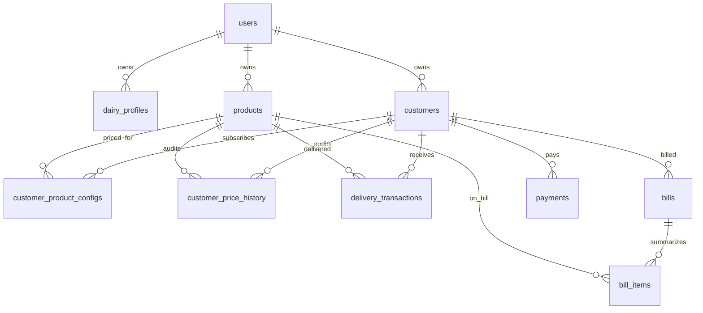

# Technical Architecture — LITER

Accurate as of the current `main` branch. This document describes **what is actually built**; for product scope and requirement status see `requirement.md`, for onboarding see `README.md`.

---

## 1. Repository Structure

```
Liter/
├── backend/                          # Spring Boot 3.3.2 (Java 21)
│   ├── Dockerfile                    # Multi-stage Maven build → Temurin 21 JRE, port 8080
│   ├── pom.xml                       # No wrapper: requires a local Maven 3.9+
│   └── src/
│       ├── main/java/com/liter/
│       │   ├── LiterApplication.java # Entry point; seeds 'admin' when users table is empty
│       │   ├── config/               # DatabaseSchemaMigrator (idempotent SQL on startup)
│       │   ├── controller/           # Auth, Customers, Products, Delivery, Billing,
│       │   │                         # Payment, Report, Settings controllers
│       │   ├── dto/                  # Request/response records and aggregation DTOs
│       │   ├── model/                # JPA entities
│       │   ├── repository/           # Spring Data JPA interfaces
│       │   ├── security/             # JwtUtils, JwtAuthFilter, SecurityConfig, UserDetailsServiceImpl
│       │   └── service/              # BillingService, PaymentService
│       ├── main/resources/
│       │   └── application.yml       # Single profile; env-var driven (no committed secrets)
│       └── test/java/com/liter/service/BillingAndPaymentTests.java
├── frontend/                         # React 19 SPA (TypeScript + Vite 8)
│   ├── index.html                    # Viewport/theme metas; html2pdf.js from CDN
│   ├── vercel.json                   # SPA rewrite /(.*)
→ /index.html
│   ├── .env.example                  # Template for VITE_API_URL (real .env is untracked)
│   ├── vite.config.ts
│   └── src/
│       ├── main.tsx / App.tsx        # Router + layout shell
│       ├── config/api.ts             # getApiUrl(): VITE_API_URL (appends /api)
│       ├── context/AuthContext.tsx   # JWT session in localStorage + authFetch wrapper
│       ├── components/               # Header, Sidebar, BottomNav, MoreDrawer, ProtectedRoute
│       └── pages/                    # Home, Login, Register, Dashboard, Deliveries,
│                                     # Customers, Billing, Products, Reports, Settings
├── docker-compose.yml                # PostgreSQL 15 service only
├── requirement.md                    # Requirements with implementation-status markers
└── README.md
```

Not present (do not assume): Maven wrapper (`mvnw`), H2 dev profile, Flyway/Liquibase, `render.yaml`, GitHub Actions.

---

## 2. Runtime Stack

| Area | Choice | Notes |
| --- | --- | --- |
| Language (API) | Java 21 | |
| Framework | Spring Boot 3.3.2 | Web, Data JPA, Security, Validation |
| Auth | Spring Security + JJWT 0.11.5 | HS256; secret & TTL from env |
| Persistence | Spring Data JPA / Hibernate | `ddl-auto: update`; Postgres driver |
| Build | Maven (no wrapper) | `spring-boot-maven-plugin` executable JAR |
| UI | React 19 + TypeScript | `react-router-dom` 7, `lucide-react`, `date-fns` |
| UI build | Vite 8 | `@vitejs/plugin-react`; lint via `oxlint` |
| PDF | `html2pdf.js` (CDN) | Falls back to `window.print()` |
| Database | PostgreSQL 15 | `docker-compose.yml` for local; schema by Hibernate + startup migrator |
| Timezone | JVM default `Asia/Kolkata` | Set in `LiterApplication`; Jackson serializes UTC |

---

## 3. Request Flow

```
Browser ── fetch(apiUrl + path, Authorization: Bearer)
   └─ Vercel SPA (static)
        └─ Spring Security filter chain
             ├─ OPTIONS /** , /api/auth/** → permitAll
             └─ everything else → JwtAuthFilter → SecurityContext(UsernamePasswordAuthenticationToken)
                  └─ Controllers resolve owner via UserRepository.findByUsername(principal)
                       └─ Spring Data queries filtered by user_id
                            └─ PostgreSQL
```

Multi-tenancy is enforced **in the query layer** (ownership columns + principal checks), not by schema separation.

---

## 4. Data Model

Schema is created by Hibernate from the entities below, then adjusted by `DatabaseSchemaMigrator` (additive SQL; failures are logged, never fatal).

| Table | Key columns | Constraints / notes |
| --- | --- | --- |
| `users` | username (UK), email (UK), password (BCrypt), full_name, role, active | Seeded `admin` on empty DB |
| `dairy_profiles` | business_name, owner_name, mobile_number, address, upi_id | 1:1 with user (nullable) |
| `customers` | user_id (owner), name, mobile_number, address, start_date, status, notes | Unique name per owner (repository-enforced) |
| `products` | user_id, name, category, unit, default_price, active | Unique name per owner |
| `customer_product_configs` | customer_id, product_id, default_quantity, custom_price, active | Unique (customer, product) |
| `customer_price_history` | customer_id, product_id, price, start_date, end_date | Open interval = current price |
| `delivery_transactions` | customer_id, product_id, delivery_date, session, quantity, unit, applied_price, total_amount, status, notes | Unique (customer, product, date, session); `DELIVERED` / `SKIPPED` |
| `bills` | customer_id, bill_period_start, bill_period_end, issue_date, total_amount, paid_amount, outstanding_amount, status | `UNPAID` / `PARTIALLY_PAID` / `PAID` |
| `bill_items` | bill_id, product_id, total_quantity, average_price, total_amount | Per-product rollup per bill |
| `payments` | customer_id, payment_date, amount, payment_method, reference_number, notes | Amount > 0 validated in service |

Entity relationships:



---

## 5. API Surface

Base path `/api`. Controllers: `AuthController`, `CustomerController`, `ProductController`, `DeliveryController`, `BillingController`, `PaymentController`, `ReportController`, `SettingsController`.

| Area | Endpoints (method → path) |
| --- | --- |
| Auth | POST `/auth/register`, POST `/auth/login`, GET `/auth/me` |
| Customers | GET `/`, POST `/`, PUT `/{id}`, PATCH `/{id}/status`, DELETE `/{id}`, GET `/{id}/configs`, PUT `/{customerId}/configs/{productId}` |
| Products | GET `/`, POST `/`, PUT `/{id}`, PATCH `/{id}/status`, DELETE `/{id}` |
| Deliveries | GET `/sheet?date&session`, POST `/mark-all-present`, POST `/mark-all-absent`, GET `/customer-history/{customerId}?year&month`, POST `/bulk` |
| Billing | POST `/generate`, GET `/history?start&end&customerId`, GET `/{id}`, GET `/{id}/items`, GET `/{id}/daywise`, DELETE `/{id}`, DELETE `/all` |
| Payments | POST `/`, GET `/?customerId` |
| Reports | GET `/analytics?start&end&productId&customerId`, GET `/dashboard`, GET `/products?start&end`, GET `/customers` |
| Settings | GET `/` (alias `/profile`), POST `/profile`, DELETE `/account` |

Cross-cutting behavior:

* **Ownership checks** on customer/product mutations, bill deletion, and settings; two report endpoints and the payments list are currently **not** principal-scoped (open item).
* **Snapshotting**: `/bulk` computes `total_amount = quantity × applied_price` server-side; controllers never trust client-computed totals.
* **Effective start date**: earlier of `customer.startDate` and `createdAt`; deliveries dated before it are rejected in `/bulk`.

---

## 6. Billing & Payments Internals

### BillingService.generateBillForCustomer(customerId, start, end, principal)
1. Load customer, verify ownership (`SecurityException` on mismatch).
2. Fetch `DELIVERED` transactions in the inclusive range.
3. Total = Σ `quantity × appliedPrice` (BigDecimal, `HALF_UP`, scale 2).
4. Reuse an existing bill for the same (customer, start, end) — deleting its items — else insert a new `Bill` (`UNPAID`).
5. Group transactions by product into `BillItem` rows (quantity, average price, amount).

### PaymentService.recordPayment(...): FIFO allocation
1. Validate amount > 0; persist the `Payment`.
2. Load bills with status ≠ `PAID`, ordered by `bill_period_start ASC`.
3. Walk the list: settle fully when remaining ≥ outstanding (`PAID`), else apply partially (`PARTIALLY_PAID`) and stop.
4. Excess beyond all outstanding is **not** carried as credit (roadmap).

---

## 7. Startup Sequence

1. `LiterApplication.main` sets JVM timezone to `Asia/Kolkata`.
2. Hibernate `ddl-auto: update` syncs tables from entities.
3. `DatabaseSchemaMigrator` runs idempotent one-off SQL: widens `unit` columns, drops legacy dairy/livestock columns, consolidates morning/evening defaults into `default_quantity`, forces `session='DAILY'`, backfills `user_id` / `start_date`.
4. If `users` is empty, seeds owner `admin` (change immediately outside local dev).

---

## 8. Frontend Architecture

* **Session**: `AuthContext` stores token/username/fullName in `localStorage` (`liter_*` keys) with a 30-day client-side expiry; `authFetch` attaches `Authorization: Bearer` and forwards JSON bodies.
* **Routing** (`App.tsx`): public `/`, `/register`, `/login`; protected `/dashboard`, `/delivery`, `/customers`, `/billing`, `/products`, `/reports`, `/settings`; unknown → `/`.
* **Layout**: `Header` + `Sidebar` ≥768px; `BottomNav` + `MoreDrawer` <768px; `ProtectedRoute` guards private routes.
* **State**: local `useState`/`useMemo` per page; no global store beyond `AuthContext`.
* **Invoice output**: modal with profile header, `/items` product lines, `/daywise` rows; print CSS + `html2pdf.js` (CDN).

---

## 9. Local Development

### 1. Database
```bash
POSTGRES_PASSWORD=<local password> docker compose up -d
```

### 2. Backend
```bash
cd backend
DB_PASSWORD=<local password> JWT_SECRET=$(openssl rand -base64 48) mvn spring-boot:run
```
API on `http://localhost:8080`. Executable JAR: `mvn clean package -DskipTests` → `backend/target/`.

### 3. Frontend
```bash
cd frontend
cp .env.example .env        # set VITE_API_URL if the API is not localhost:8080
npm install
npm run dev                 # http://localhost:5173
```
Scripts: `npm run build` (`tsc -b && vite build`), `npm run preview`, `npm run lint`.

### Tests
`mvn test` — `BillingAndPaymentTests` is a `@SpringBootTest` that requires a reachable PostgreSQL matching `DB_*`; point it at a **scratch database**. Coverage: custom-price-over-default billing math and FIFO payment allocation across two bills. Frontend has lint only.

---

## 10. Deployment

| Piece | Mechanism |
| --- | --- |
| Backend | `backend/Dockerfile` (Maven package → JRE 21), runs on 8080; supply `DB_URL`, `DB_USERNAME`, `DB_PASSWORD`, `JWT_SECRET` as environment |
| Frontend | Vercel static build of `frontend/` with `VITE_API_URL` set; `vercel.json` SPA rewrite |
| Database | Managed PostgreSQL (e.g. Render); **no** credentials in the repo — env-only |

Compose is for local Postgres only; it does not build or run the app services.

---

## 11. Engineering Notes & Known Gaps

* **Single `application.yml`** — no profile files; every environment variable is documented in `README.md`.
* **No versioned migrations** — Hibernate update + idempotent startup SQL; a migration tool (Flyway) is the roadmap replacement.
* **Query performance** — several endpoints load more rows than needed (per-row lookups on the delivery sheet, `findAll()`-based report scans, unscoped dashboard queries) and key date/owner columns are unindexed; batched queries, `@EntityGraph` fetch joins, and `@Table(indexes=…)` are the identified remedies.
* **Security open items** — CSRF disabled (stateless JWT), permissive CORS, JWT in `localStorage`, CDN-loaded PDF library, simulated password reset, three unscoped endpoints (dashboard, product report, payments list, customer-history calendar).
* **CI/CD** — none yet; builds are local via Maven and Vercel's Git integration.
